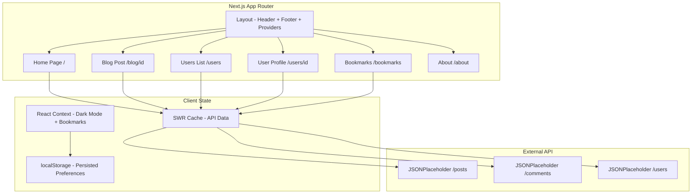
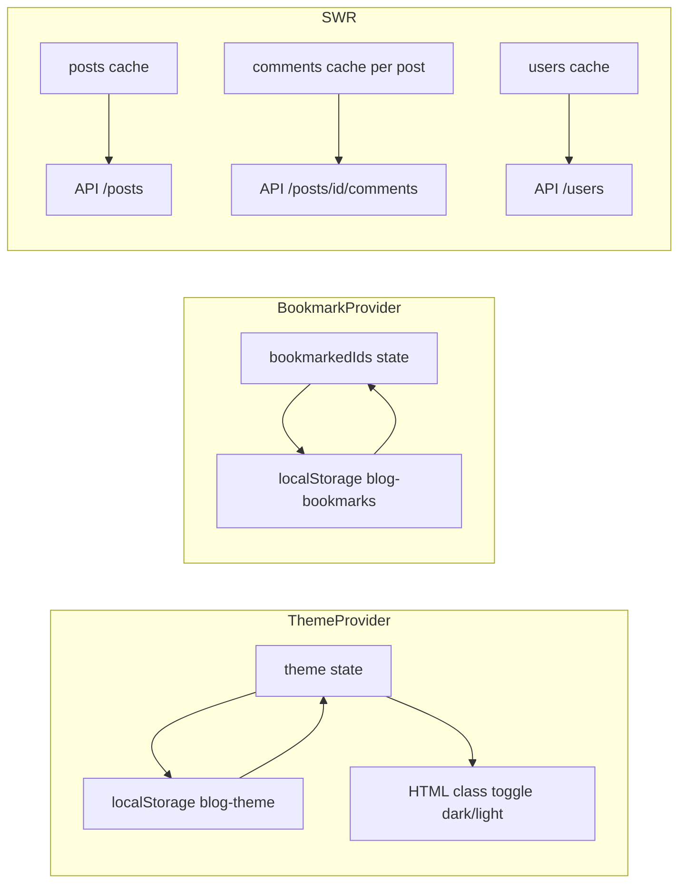

# Design Document: Full Blog Enhancement

## Overview

This design extends the existing Next.js blog viewer into a feature-rich blog platform. The current app fetches posts from JSONPlaceholder, displays them in a paginated grid with search, and shows individual post detail pages. The enhancement adds comments, user profiles, author filtering, improved navigation (breadcrumbs, new pages), reading progress, bookmarks (localStorage), social sharing, manual dark mode toggling, SEO improvements, and skeleton loading states.

All new features integrate with the existing App Router architecture, SWR-based data fetching, Tailwind CSS styling, and Axios HTTP client. No new major dependencies are introduced.

## Architecture

### High-Level Architecture



### Design Decisions

1. **React Context for cross-cutting state**: Dark mode preference and bookmark state need to be accessible across all pages. A lightweight React Context with localStorage persistence avoids prop-drilling while keeping the solution simple.

2. **SWR for all API data**: Consistent with the existing pattern. SWR provides caching, deduplication, and revalidation out of the box.

3. **Client Components for interactive features**: Comments form, bookmark buttons, dark mode toggle, reading progress, and share buttons are all client components. Static pages (about, SEO files) remain server components.

4. **localStorage for persistence**: Bookmarks and dark mode preference persist via localStorage. This avoids needing a backend/database for user preferences.

5. **Optimistic updates for comments**: The comment form adds the new comment to the local list immediately before the API response returns, matching the existing JSONPlaceholder "fake" write pattern.

## Components and Interfaces

### New Components

| Component | Type | Location | Purpose |
|-----------|------|----------|---------|
| `CommentList` | Client | `components/comment-list.tsx` | Fetches and displays comments for a post |
| `CommentForm` | Client | `components/comment-form.tsx` | Form to submit a new comment |
| `AuthorFilter` | Client | `components/author-filter.tsx` | Dropdown/chip filter for authors on homepage |
| `ReadingProgress` | Client | `components/reading-progress.tsx` | Fixed progress bar at viewport top |
| `BookmarkButton` | Client | `components/bookmark-button.tsx` | Toggle bookmark state for a post |
| `ShareButtons` | Client | `components/share-buttons.tsx` | Copy link, Twitter, LinkedIn share |
| `DarkModeToggle` | Client | `components/dark-mode-toggle.tsx` | Sun/Moon icon toggle in header |
| `Breadcrumb` | Client | `components/breadcrumb.tsx` | Hierarchical navigation breadcrumb |
| `SkeletonCard` | Server | `components/skeleton-card.tsx` | Shimmer placeholder for blog cards |
| `SkeletonPost` | Server | `components/skeleton-post.tsx` | Shimmer placeholder for post detail |
| `SkeletonUser` | Server | `components/skeleton-user.tsx` | Shimmer placeholder for user pages |

### New Context Providers

| Provider | Location | Purpose |
|----------|----------|---------|
| `BookmarkProvider` | `contexts/bookmark-context.tsx` | Manages bookmarked post IDs in localStorage |
| `ThemeProvider` | `contexts/theme-context.tsx` | Manages dark/light mode with localStorage persistence |

### Modified Components

| Component | Changes |
|-----------|---------|
| `Header` | Add navigation links (Home, Users, About), add `DarkModeToggle` |
| `BlogCard` | Add `BookmarkButton`, make author name a link to `/users/[userId]` |
| `layout.tsx` | Wrap children with `ThemeProvider` and `BookmarkProvider` |
| `app/blog/[id]/page.tsx` | Add `CommentList`, `ShareButtons`, `ReadingProgress`, `Breadcrumb` |
| `app/page.tsx` | Add `AuthorFilter`, use `SkeletonCard` during loading |

### New Pages/Routes

| Route | File | Type | Purpose |
|-------|------|------|---------|
| `/users` | `app/users/page.tsx` | Server | List all users |
| `/users/[id]` | `app/users/[id]/page.tsx` | Server + Client | User profile with posts |
| `/bookmarks` | `app/bookmarks/page.tsx` | Client | Bookmarked posts list |
| `/about` | `app/about/page.tsx` | Server | Static about page |
| `/sitemap.xml` | `app/sitemap.ts` | Server (Route) | Dynamic sitemap generation |
| `/robots.txt` | `app/robots.ts` | Server (Route) | Robots file |

## Data Models

### New Types (additions to `lib/types.ts`)

```typescript
export interface Comment {
  postId: number;
  id: number;
  name: string;
  email: string;
  body: string;
}

export interface User {
  id: number;
  name: string;
  username: string;
  email: string;
  address: {
    street: string;
    suite: string;
    city: string;
    zipcode: string;
  };
  phone: string;
  website: string;
  company: {
    name: string;
    catchPhrase: string;
    bs: string;
  };
}

export interface BookmarkState {
  bookmarkedIds: number[];
  addBookmark: (postId: number) => void;
  removeBookmark: (postId: number) => void;
  isBookmarked: (postId: number) => boolean;
  toggleBookmark: (postId: number) => void;
}

export interface ThemeState {
  theme: 'light' | 'dark';
  toggleTheme: () => void;
}
```

### API Endpoints Used

| Endpoint | Method | Purpose |
|----------|--------|---------|
| `GET /posts` | GET | Fetch all posts (existing) |
| `GET /posts/{id}` | GET | Fetch single post (existing) |
| `GET /posts/{id}/comments` | GET | Fetch comments for a post |
| `POST /posts/{id}/comments` | POST | Submit a new comment |
| `GET /users` | GET | Fetch all users |
| `GET /users/{id}` | GET | Fetch single user profile |

### New API Client Functions (additions to `lib/api-client.ts`)

```typescript
// Fetch comments for a specific post
export async function fetchCommentsByPostId(postId: number): Promise<Comment[]>

// Submit a new comment (optimistic - JSONPlaceholder returns fake response)
export async function submitComment(postId: number, comment: Omit<Comment, 'id' | 'postId'>): Promise<Comment>

// Fetch all users
export async function fetchAllUsers(): Promise<User[]>

// Fetch a single user by ID
export async function fetchUserById(id: number): Promise<User | null>

// Fetch posts by a specific user
export async function fetchPostsByUserId(userId: number): Promise<BlogPost[]>
```

### localStorage Schema

| Key | Type | Description |
|-----|------|-------------|
| `blog-bookmarks` | `number[]` (JSON) | Array of bookmarked post IDs |
| `blog-theme` | `'light' \| 'dark'` | User's dark mode preference |

### State Management Flow



## Error Handling

| Scenario | Handling Strategy |
|----------|------------------|
| API fetch failure (posts/users/comments) | SWR error state → display error message with retry option |
| Comment submission failure | Show error toast, keep form data intact for resubmission |
| Invalid post/user ID in URL | Return "Not Found" UI with link back to home |
| localStorage unavailable | Graceful fallback: bookmarks/theme work in memory only for session |
| Empty comment form submission | Client-side validation prevents submission, shows field errors |
| Network timeout | Axios 10s timeout → SWR error state → user-facing error message |

## Testing Strategy

### Unit Tests (Example-based)

- Comment form validation (empty fields, valid submission)
- Bookmark toggle logic (add, remove, check state)
- Dark mode toggle (switch states, persistence)
- Author filter logic (filter by userId, clear filter)
- Reading progress calculation (0% at top, 100% at bottom)
- Share URL generation (Twitter, LinkedIn, Copy Link)

### Integration Tests

- Full comment flow: load comments → submit → see new comment in list
- Bookmark flow: bookmark a post → navigate to /bookmarks → see post listed
- Navigation: breadcrumb links resolve correctly
- Dark mode: toggle → refresh → preference restored
- SEO: sitemap.xml contains all post URLs, robots.txt allows crawling

### Property-Based Tests

The feature involves data transformations (filtering, searching, bookmark state management) that are suitable for property-based testing. Specific properties are defined in the Correctness Properties section below.


## Correctness Properties

*A property is a characteristic or behavior that should hold true across all valid executions of a system — essentially, a formal statement about what the system should do. Properties serve as the bridge between human-readable specifications and machine-verifiable correctness guarantees.*

### Property 1: Comment rendering completeness

*For any* valid Comment object with non-empty name, email, and body fields, rendering the comment component SHALL produce output containing all three fields.

**Validates: Requirements 1.2**

### Property 2: Optimistic comment addition

*For any* valid comment submission data (non-empty name, email, and body), submitting the comment form SHALL immediately add the comment to the displayed comment list before the API response resolves.

**Validates: Requirements 1.4**

### Property 3: Comment validation rejects invalid input

*For any* combination of required comment fields where at least one field is empty or whitespace-only, the comment form SHALL reject the submission and display validation errors.

**Validates: Requirements 1.5**

### Property 4: User profile rendering completeness

*For any* valid User object, rendering the user profile component SHALL produce output containing the user's name, email, phone, website, company name, and address city.

**Validates: Requirements 2.2**

### Property 5: Author link correctness

*For any* BlogPost with a userId, rendering the blog card or post page SHALL produce an author link with href equal to `/users/{userId}`.

**Validates: Requirements 2.4**

### Property 6: Filter by author shows only matching posts

*For any* set of posts and any selected userId filter, the displayed posts SHALL all have a userId matching the selected filter value. Additionally, no post with the selected userId SHALL be excluded from the results.

**Validates: Requirements 2.3, 3.2**

### Property 7: Clear filter restores full post list

*For any* set of posts and any previously applied author filter, clearing the filter SHALL result in displaying all original posts regardless of their userId.

**Validates: Requirements 3.4**

### Property 8: Breadcrumb path generation

*For any* page title string (post title or user name), the breadcrumb component SHALL render a path containing the correct hierarchy segments. For blog posts: "Home > Blog > [title]". For user profiles: "Home > Users > [name]".

**Validates: Requirements 4.2, 4.3**

### Property 9: Reading progress bounds and proportionality

*For any* scroll position value between 0 and the maximum scrollable distance, the calculated reading progress SHALL be a value between 0 and 100 inclusive, where 0 scroll produces 0% and maximum scroll produces 100%.

**Validates: Requirements 5.1, 5.2, 5.3**

### Property 10: Bookmark toggle round-trip

*For any* post ID, adding a bookmark and then checking localStorage SHALL show the ID present. Removing a bookmark and then checking localStorage SHALL show the ID absent. Toggling twice SHALL return to the original state (self-inverse).

**Validates: Requirements 6.1, 6.3**

### Property 11: Bookmark state reflection in UI

*For any* set of bookmarked post IDs and any post ID that exists in that set, the bookmark button for that post SHALL render in an active/filled state. For any post ID NOT in the set, the button SHALL render in an inactive state.

**Validates: Requirements 6.2**

### Property 12: Share URL generation contains required data

*For any* blog post with a title and page URL, the generated Twitter/X share URL SHALL contain the URL-encoded post title and the page link. The generated LinkedIn share URL SHALL contain the page link.

**Validates: Requirements 7.3, 7.4**

### Property 13: Theme toggle is self-inverse

*For any* initial theme state (light or dark), clicking the toggle once SHALL switch to the opposite theme, and clicking it again SHALL return to the original theme.

**Validates: Requirements 8.2**

### Property 14: Theme persistence round-trip

*For any* theme value ('light' or 'dark'), persisting it to localStorage and then initializing the theme provider SHALL result in the same theme value being applied.

**Validates: Requirements 8.3, 8.4**

### Property 15: JSON-LD structured data completeness

*For any* valid BlogPost object, the generated JSON-LD structured data SHALL contain the post's title, author (derived from userId), and description (derived from body).

**Validates: Requirements 9.1**

### Property 16: Sitemap URL coverage

*For any* set of blog posts and users, the generated sitemap SHALL contain a URL entry for every post (`/blog/{id}`) and every user profile (`/users/{id}`).

**Validates: Requirements 9.2**

